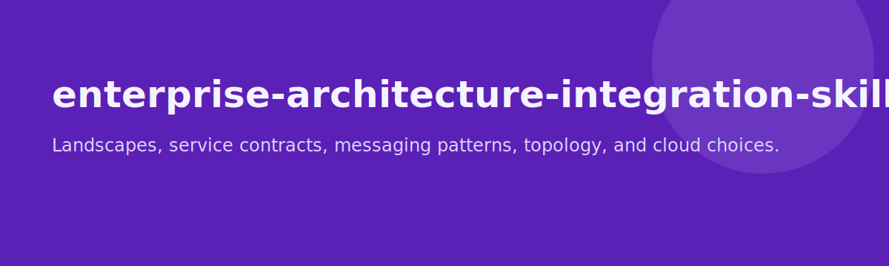

# enterprise-architecture-integration-skills

<p align="center">
  
</p>

<p align="center">
  
</p>

<p align="center">
  <a href="LICENSE"></a>
  
  
</p>

A platform-neutral enterprise architecture and integration skill pack for application landscapes, integration patterns, messaging, environments, hosting, and cloud/topology decisions.

## Included skills

- `application-landscape-mapper`
- `ci-cd-readiness-checker`
- `container-vs-vm-advisor`
- `enterprise-context-mapper`
- `enterprise-domain-alignment-checker`
- `environment-topology-planner`
- `esb-fit-reviewer`
- `loose-coupling-checker`
- `message-bus-selector`
- `orchestration-vs-choreography-reviewer`
- `public-private-hybrid-cloud-selector`
- `publish-subscribe-designer`
- `rpc-vs-message-pattern-selector`
- `service-contract-designer`
- `soa-suitability-reviewer`

## Features

- Preserves the original `skills/`, `templates/`, and `examples/` source material
- Mirrors packaged skills into both `.claude/skills/` and `.agents/skills/`
- Covers architecture, integration, messaging, topology, and deployment strategy in one pack

## Install

### Option A: Install globally

```bash
git clone https://github.com/45ck/enterprise-architecture-integration-skills.git
cd enterprise-architecture-integration-skills
bash install.sh
```

This installs every packaged skill into both:

- `~/.claude/skills/`
- `~/.agents/skills/`

### Option B: Copy into a project

```bash
cp -R .claude /path/to/your-project/
cp -R .agents /path/to/your-project/
```

### Uninstall

```bash
bash uninstall.sh
```

## Usage

```text
/enterprise-context-mapper student administration domain
/application-landscape-mapper current internal systems
/service-contract-designer payment service integration
/message-bus-selector internal event platform
/orchestration-vs-choreography-reviewer order fulfillment flow
/public-private-hybrid-cloud-selector hosting strategy for regulated workloads
```

## Repo structure

```text
skills/                              original source skills
templates/                           reusable templates
examples/                            sample flow material
.claude/skills/<skill>/SKILL.md      packaged skill format
.agents/skills/<skill>/SKILL.md      mirrored packaged skill format
install.sh                           global installer
uninstall.sh                         global uninstaller
LICENSE                              MIT
```

## Related skill packs

- [software-architecture-skills](https://github.com/45ck/software-architecture-skills) - Architecture options, views, risks, and tradeoff writing
- [data-structures-algorithmic-reasoning-skills](https://github.com/45ck/data-structures-algorithmic-reasoning-skills) - Data structure selection and algorithmic reasoning skills
- [oop-code-structure-skills](https://github.com/45ck/oop-code-structure-skills) - Object-oriented design and class-structure review skills
- [web-engineering-skills](https://github.com/45ck/web-engineering-skills) - Web request handling, MVC, validation, routing, and navigation skills
- [backend-persistence-skills](https://github.com/45ck/backend-persistence-skills) - Persistence, schema, ORM, query, and migration skills
- [uml-analysis-modelling-skills](https://github.com/45ck/uml-analysis-modelling-skills) - UML analysis and modelling skills
- [business-analysis-skills](https://github.com/45ck/business-analysis-skills) - Business analysis techniques, workflows, and quality checks
- [marketing-product-skills](https://github.com/45ck/marketing-product-skills) - Product strategy, growth, positioning, launch, SEO, and pricing skills
- [hci-review-skill](https://github.com/45ck/hci-review-skill) - Structured HCI and UX review skills
- [fagan-inspection-skill](https://github.com/45ck/fagan-inspection-skill) - Formal inspection and defect-review skills

## License

[MIT](LICENSE)
